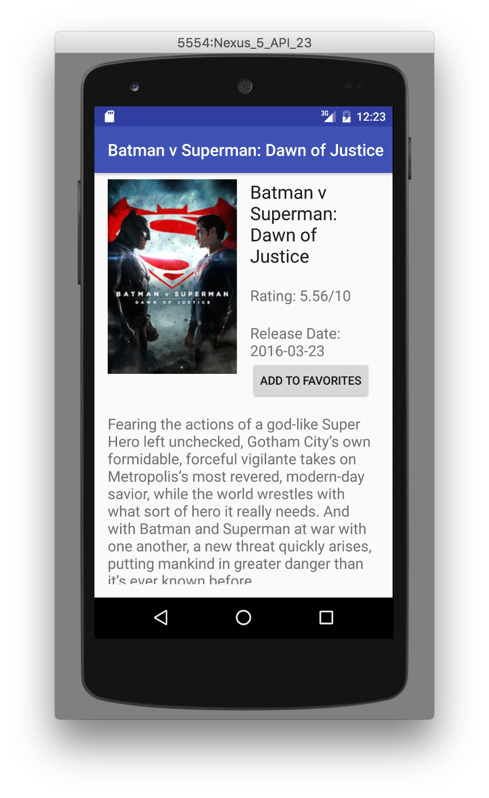

# Udacity-Project-2
##Popular Movies 2

###Overview:

Udacity's Project 2 Popular Movies 2 was to improve upon [Popular Movies](https://github.com/chris-shum/Udacity-Project-1). Popular Movies features [The Movie DB's API](https://www.themoviedb.org/).  The app displays a list of movies in a RecyclerView sorted by popularity or rating. The improvements made were to its design, it now features an overflow menu, and there are lists which hold trailers and reviews.  The trailers can be played externally on the Youtube app.  Movies can also be favorited/unfavorited.  Favorited movies are stored into a SQLite database and can also be displayed. The app was formatted to work in both portrait, landscape and tablet mode.

##Screenshots:

 
 
 
 
 
 
